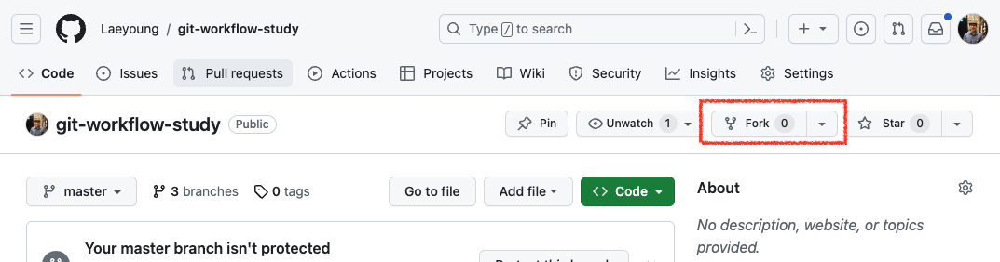
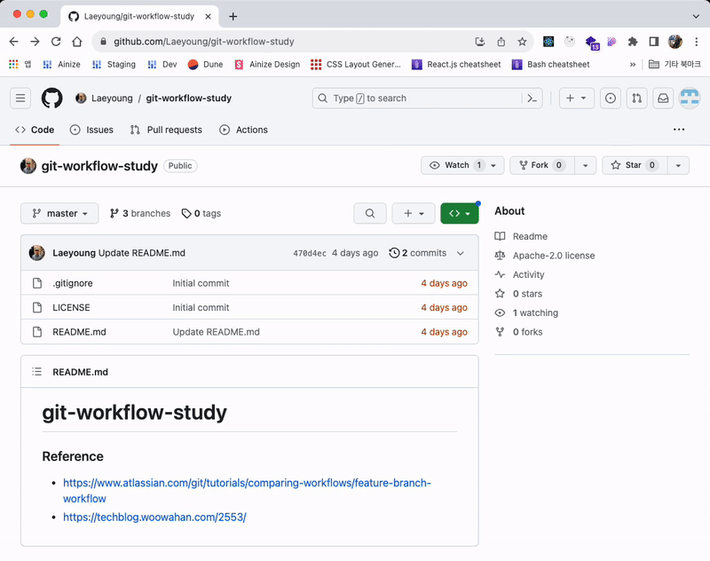
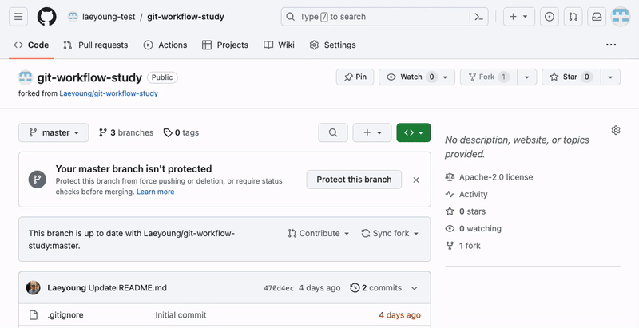
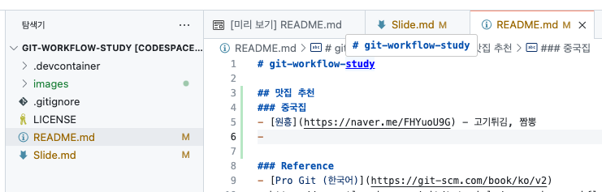
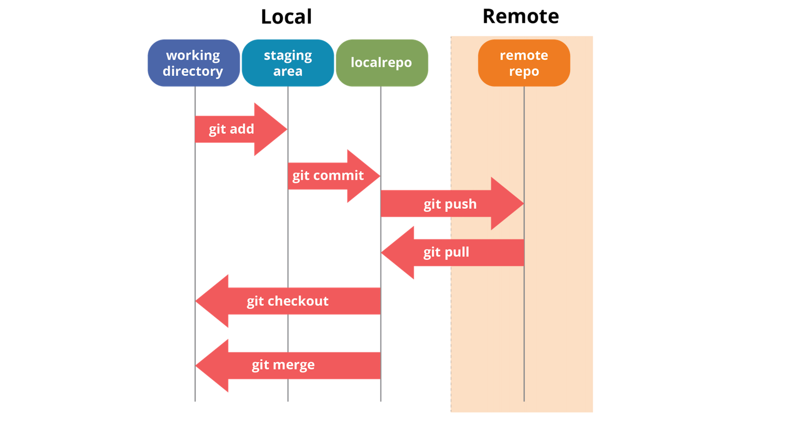

# Github로 따라 배우는 Git 활용법

---

# 왜 Git 쓰나요?

---

# v1.0.0_최종_최종_lastest.zip
1. commit 단위로 히스토리가 괸리되고 (undo와 redo가 용이함)
2. branch 단위로 분리 할 수 있고 (작업 버전 분리를 위해, 폴더 복붙 필요 없음)
3. diff 단위로 저장해서 저장소 용량이 상대적으로 작음
4. 그리고 남들이 다 써요 😊

---

# SVN vs GIT
Git은 원격에 있는 Repo가 터져도 알빠노 실행 가능한 구조


---

# Github에서 따라 배우기

---
 
# Introduction to Github
- [직장인들의 사이드 프로젝트로 시작됨](https://eopla.net/magazines/6661)
- 전세계에서 제일 큰 Git 호스팅 사이트
- 거의 모든 Open Source 프로젝트들이 Github 위에서 프로젝트 개발 중
- 1억명의 Active User가 사용 중
- 2018년에 MS가 75억달러에 인수함

---

## 1. Github 회원가입

---

## 2. 아래 있는 Repo에 가서 Fork 버튼을 누릅니다.
## https://github.com/Laeyoung/git-workflow-study

 
---


 
---

## 3. 내 Repo에서 Codespace 만들기


 
---

## 4. Slide.md 열기

 
---

## 5. 뭐가 있는지 봅시다
VS Code 하단 터미널 화면에서
```bash
$ git branch -a
```
 
---

## 6. 새로운 branch 만들기

```bash
$ git checkout -b feature/YOUR_NAME
```
- YOUR_NAME을 본인 이름으로 바꿔주세요

---

## 7. README.md에 맛집 추가하기


아는 맛집 추가하고 저장

---

## 8. `git status`로 현재 git 상태 확인

```bash
$ git status
```
어떤게 바뀌었나요?

---

# Git 101

---

## Unstaged / Staged / Commit


---
 
## Basic Git commands
- `git add`: 변경된 파일을 스테이징에 추가
- `git commit`: 스테이징된 파일 커밋
- `git push`: 현재 commit된 내용을 remote repo에 push해서 반영
- `git pull`: 현재 remote repo에 있는 commit 내용을 local repo에 pull해서 반영

---

## Basic Git commands
- `git init`: 새로운 Git 저장소(local) 초기화
- `git clone`: 원격 저장소을 local repo로 복사
- `git status`: 현재 상태 확인
- `git log`: 커밋 히스토리 조회

---

# Git Branch Strategy

--- 

 
# Git Flow
  


--- 

# Creating a new repository

 

- Creating a repository on Github

- Initializing a local repository

- Linking the local and remote repositories

 

<!-- Presenter's script: 

"Now that we know the basic Git commands, let's learn how to create a new repository. We will cover creating a repository on Github, initializing a local repository, and linking the local and remote repositories for seamless collaboration." 

-->

 

---

 

# Cloning a repository

 

- Cloning a repository from Github

- Cloning a repository using SSH or HTTPS

 

<!-- Presenter's script: 

"In this slide, we will learn how to clone an existing repository from Github. We will cover cloning a repository using both SSH and HTTPS protocols, and discuss the advantages of each method." 

-->

 

---

 

# Making changes and committing

 

- Making changes to files

- Staging and committing changes

- Writing meaningful commit messages

 

<!-- Presenter's script: 

"Now that we have a repository set up and cloned, let's explore how to make changes to files and commit those changes. We will cover staging and committing changes, as well as the importance of writing meaningful commit messages." 

-->

 

---

 

# Branching and merging

 

- Creating and switching branches

- Merging branches

- Handling merge conflicts

 

<!-- Presenter's script: 

"Branching and merging are essential concepts in Git. In this slide, we will learn how to create and switch branches, merge branches, and handle merge conflicts that may arise during the merging process." 

-->

 

---

 

# Collaborating on Github

 

- Forking a repository

- Making pull requests

- Reviewing and merging pull requests

 

<!-- Presenter's script: 

"Github provides a platform for collaborative development. In this slide, we will cover forking a repository, making pull requests to contribute changes, and the process of reviewing and merging pull requests." 

-->

 

---

 

# Pull requests

 

- Creating a pull request

- Adding comments and suggestions

- Resolving feedback

 

<!-- Presenter's script: 

"Pull requests are a crucial part of the collaborative workflow on Github. In this slide, we will learn how to create a pull request, add comments and suggestions to the code, and resolve feedback received during the review process." 

-->

 

---

 

# Resolving conflicts

 

- Understanding merge conflicts

- Resolving conflicts manually

- Using Git tools to resolve conflicts

 

<!-- Presenter's script: 

"Merge conflicts can occur when merging branches with conflicting changes. In this slide, we will understand what merge conflicts are, learn how to resolve conflicts manually, and explore Git tools that can help us in the conflict resolution process." 

-->

 

---

 

# Best practices for using Git and Github

 

- Keeping commits small and focused

- Using descriptive commit messages

- Regularly pulling changes from the remote repository

- Collaborating effectively with team members

 

<!-- Presenter's script: 

"To wrap up our presentation, let's discuss some best practices for using Git and Github. We will cover keeping commits small and focused, using descriptive commit messages, regularly pulling changes from the remote repository, and collaborating effectively with team members." 

-->

 

---

 

# Thank you!

 

<!-- Presenter's script: 

"Thank you for attending this presentation on Git and Github usage. We hope you found it informative and gained a better understanding of how to use Git and Github effectively. If you have any questions, feel free to ask." 

-->