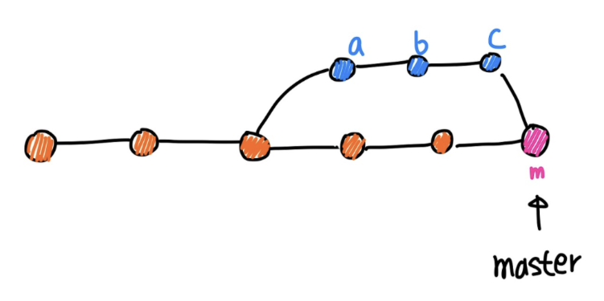
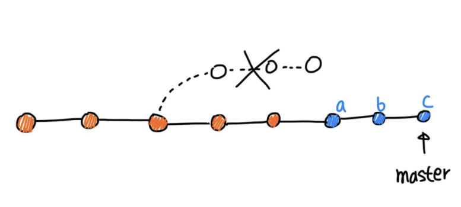
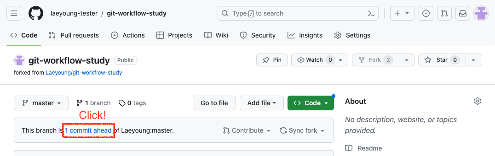
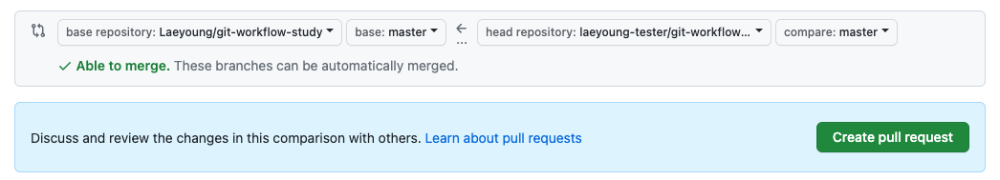
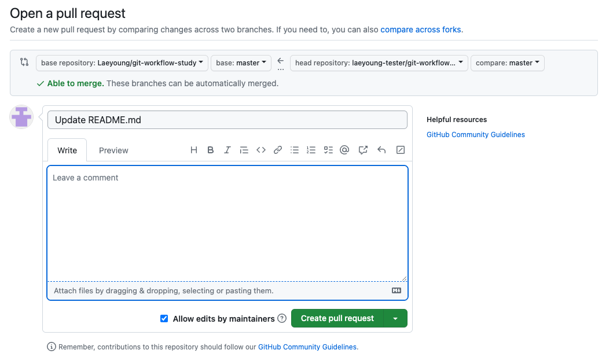

# Github로 따라 배우는 Git 활용법

---

# 왜 Git 쓰나요?

---

# v1.0.0_최종_최종_lastest.zip
1. commit 단위로 히스토리가 관리되고 (undo와 redo가 용이함)
2. branch 단위로 분리 할 수 있고 (작업 버전 분리를 위해, 폴더 복붙 필요 없음)
3. diff 단위로 저장해서 저장소 용량이 상대적으로 작음
4. 그리고 남들이 다 써요 😊

---

# SVN vs GIT
Git은 원격에 있는 Repo가 터져도 상관 없는 구조


---

# Github에서 따라 배우기

---
 
# Introduction to Github
- [직장인들의 사이드 프로젝트로 시작됨](https://eopla.net/magazines/6661)
- 전세계에서 제일 큰 Git 호스팅 사이트
- 거의 모든 Open Source 프로젝트들이 Github 위에서 프로젝트 개발 중
- 1억명의 Active User가 사용 중
- 2018년에 MS가 75억달러에 인수함

---

## 1. Github 회원가입

---

## 2. 아래 있는 Repo에 가서 Fork 버튼을 누릅니다.
## https://github.com/Laeyoung/git-workflow-study

 
---


 
---

## 3. 내 Repo에서 Codespace 만들기


 
---

## 4. Slide.md 열기

 
---

## 5. 뭐가 있는지 봅시다
VS Code 하단 터미널 화면에서
```bash
$ git branch -a
```
 
---

## 6. 새로운 branch 만들기

```bash
$ git checkout -b feature/YOUR_NAME
```
- YOUR_NAME을 본인 이름으로 바꿔주세요

---

## 7. README.md에 맛집 추가하기


아는 맛집 추가하고 저장

---

## 8. `git status`로 현재 git 상태 확인

```bash
$ git status
```
어떤게 바뀌었나요?

---

# Git 101

---

## Unstaged / Staged / Commit


---
 
## Basic Git commands(1)
- `git add`: 변경된 파일을 스테이징에 추가
- `git commit`: 스테이징된 파일 커밋
- `git push`: 현재 commit된 내용을 remote repo에 push해서 반영
- `git pull`: 현재 remote repo에 있는 commit 내용을 local repo에 pull해서 반영

---

## Basic Git commands(2)
- `git init`: 새로운 Git 저장소(local) 초기화
- `git clone`: 원격 저장소을 local repo로 복사
- `git status`: 현재 상태 확인
- `git log`: 커밋 히스토리 조회

---

# GUI를 쓰면 편하다.

- [Sourcetree](https://www.sourcetreeapp.com/) (Win / Mac) - Free
- [GitHub Desktop](https://desktop.github.com/) (Win / Mac) - Free
- [Fork](https://git-fork.com/) (Win / Mac) - Free evalutation / $49.99

--- 

## ~~Hello~~ Merge!


---

## 1. Merge Commit을 할 것인가?



---

## 2. Rebase Merge를 할 것인가?



---

# Git Branch Strategy

--- 

# Git Branch Strategy
1. 여러명이 공동 작업을 할 때, 어떻게 운영 할 것인가?
   - 사람이 많을수록 conflict가 많이 날텐데 어떻게 하지?
   - branch도 엄청 많아 질텐데 어떻게 질서 있게 관리하지?
  
2. Repo를 보러 온 사람이 어떤 걸 먼저 보기를 바라는가?
   - 해당 사람이 바로 다운 받고 실행하길 원하는가?
   - 해당 사람이 Repo에 코드 기여를 하길 바라는가?

--- 


# Git Flow
  

--- 

# Forking Workflow (Github 방식)
1. 원본 Repo에 Edit 권한을 주지 않고 fork 권한만 준다.
2. fork를 한 후, 수정 사항을 본인의 repo에 반영한다.
3. 원본 Repo에 Pull-Request(PR)을 요청한다.
4. 코드리뷰 후, 원본 Repo의 maintainer가 승인 후 직접 Merge를 한다.

--- 

# 다시 실습으로

1. `$ git add .`
2. `$ git commit -m 'docs: 여기는 블라블라 맛집입니다'`
  - commit 메세지에 아래와 같은 prefix template을 많이 씁니다.
  - feat, fix, docs, style, refactor, test, chore, ...
3. `$ git push`

---
# Pull Request (PR) 실습

- Github로 다시 돌아가서 Pull Request 보내기
https://github.com/${USER-ID}/git-workflow-study



--- 

# Pull Request (PR) 실습

- base가 Fork를 했던 `Laeyoung/git-workflow-study`인지 확인하고,
`Create pull request` 클릭


--- 



--- 

# 코드 리뷰가 왜 필요할까?
1. 이인삼각 - 한 사람이 만든 프로젝트처럼
2. 더 나은 코드 - 리뷰를 통해 더 좋은 코드를 위한 아이디어 얻기
3. Code에 대한 공통의 이해 - 내가 휴가 가도 된다, 코드 리뷰를 한 사람이 백업 해줄 수 있다

---

# Github에서 PR & 코드 리뷰 순서 (git flow 방식)
1. develop branch 상태에서 feature branch를 만든다. (ex. feature/add-cool-feature)
2. 만든 branch에서 작업을 하고 주기적으로 remote에 push 한다.
3. 작업이 완료되면, develop branch를 target으로 PR을 날리고 Reviewer를 지정한다.
4. Reviewer는 Github에서 코드 리뷰를 진행한다.
5. 코드 리뷰에서 받은 수정사항을 feature branch에 반영 후, 다시 push 한다.
6. LGTM과 Approve를 받을 때까지, 4~5를 반복한다.

###### (질문이 있거나, 설명이 필요하면 PR에 같이 써도 좋다.)

---

# 코드 리뷰 시간

다른 분들이 올린 PR을 보고, 리뷰를 해주자.
- 기존의 문서와 Format이 동일한지 확인
- 추가 되거나 더 좋은 것이 있으면 의견을 준다 (ex. 동해루도 맛집인데 같이 추가하면 어떨까요?)
- 좋은 PR이면 칭찬을 해주자 (ex. 근처에 오래 살았는데 이런 맛집이 있는 줄 몰랐네요, 감사합니다.)

---

# 유명 프로젝트들에서 어떻게 하고 있는지 구경해보자
https://github.com/MunGell/awesome-for-beginners

---
 

# Q&A
 
---

 

# Thank you!

feat. 맛집 목록이 만들어 졌다!

